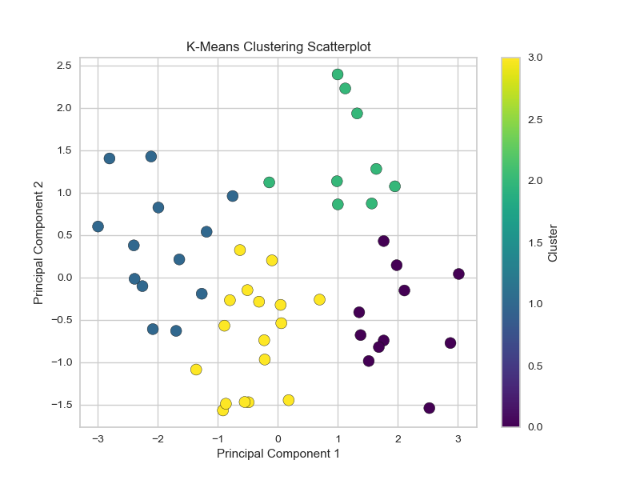
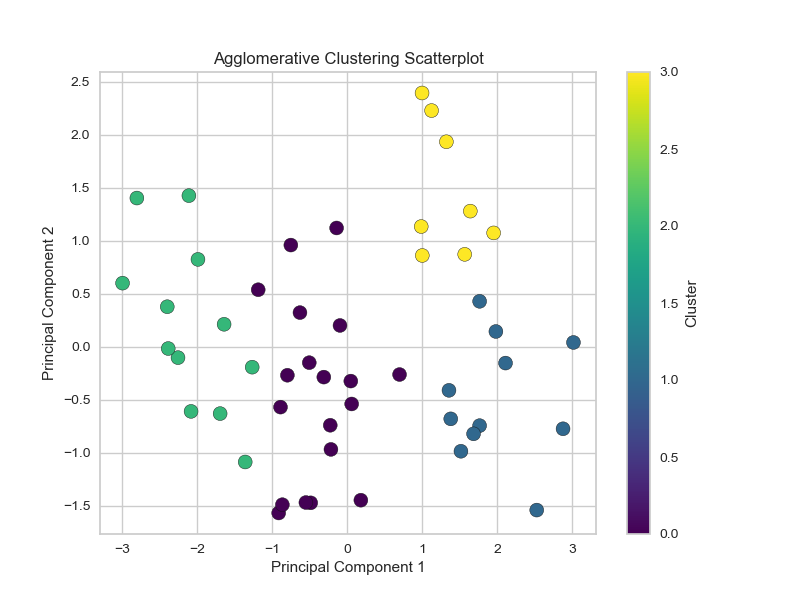
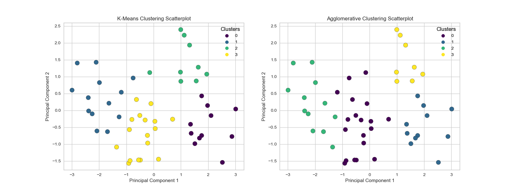

# US Arrests Analysis

This project aims to analyse crime rates across different cities in the United States. We use the `UsArrests.csv` dataset, which contains information about the number of arrests for different types of crimes (murder, assault, and rape) and the urban population percentage for each city.

## Dataset

The dataset contains the following columns:

- `City`: The name of the city
- `Murder`: The number of murder arrests (per 100,000 residents)
- `Assault`: The number of assault arrests (per 100,000 residents)
- `UrbanPop`: The percentage of the population living in urban areas
- `Rape`: The number of rape arrests (per 100,000 residents)

## Analysis

We performed the following analyses on the dataset:

1. **Principal Component Analysis (PCA):**
   - Data preprocessing, including normalization and scaling
   - Calculation of principal components
   - Elbow and silhouette scoring, eigen-vector analysis, Scree plot, and Cumulative Explained Variance plot

2. **Clustering Techniques:**
   - K-Means clustering
   - Agglomerative clustering
   - Comparison and analysis of the clusters generated by each technique

## Results

- We found that the optimal number of clusters for both K-Means and Agglomerative clustering was 4.
- The clusters generated by both techniques had similar characteristics, with the main differences between the clusters related to the levels of crime and urban population percentages.

## Requirements

To run the Jupyter Notebook, you'll need the following Python libraries:

- pandas
- numpy
- matplotlib
- seaborn
- scikit-learn

You can install these libraries using pip:

pip install pandas numpy matplotlib seaborn scikit-learn

## Usage

To run the Jupyter Notebook, open a terminal, navigate to the project directory, and run:

jupyter notebook us_arrests_analysis.ipynb

## License

No licence stated, feel free to use the file/s code/s as you please.
